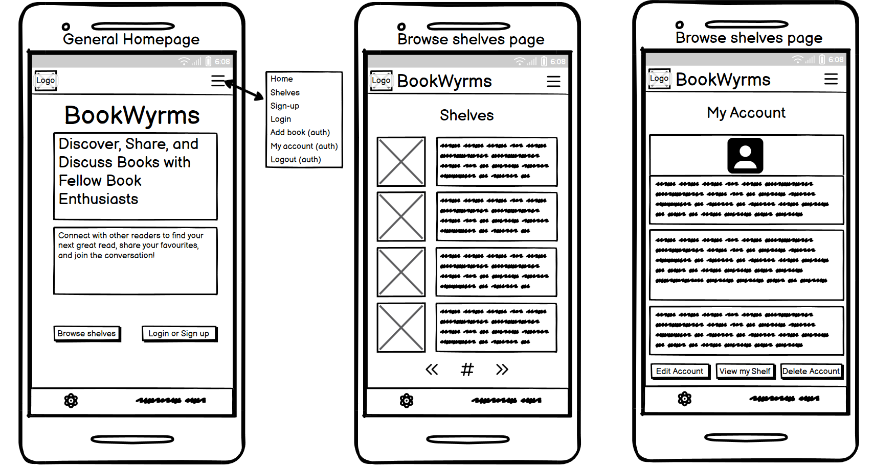
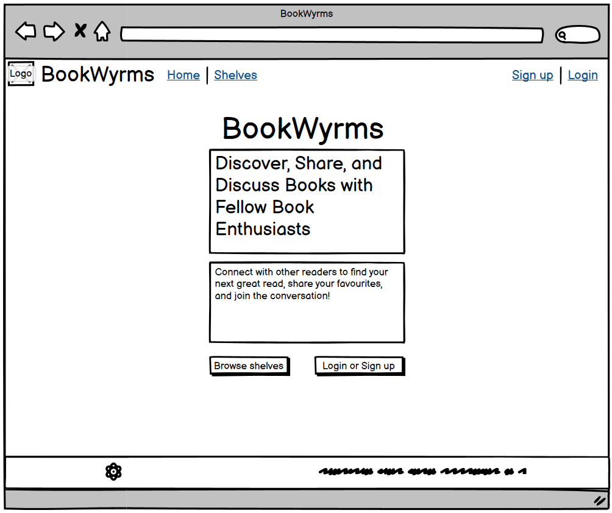
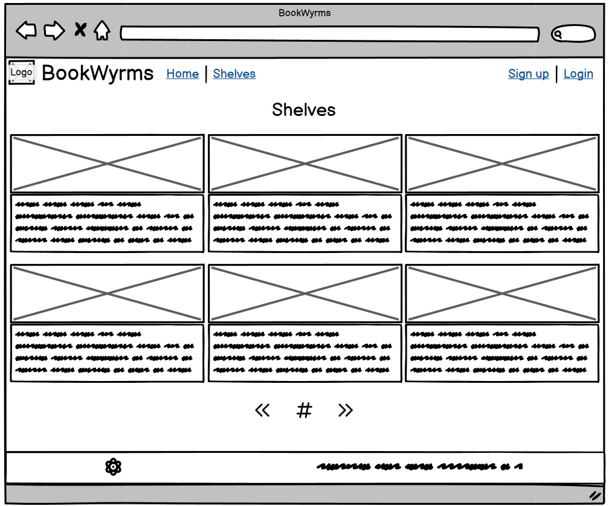
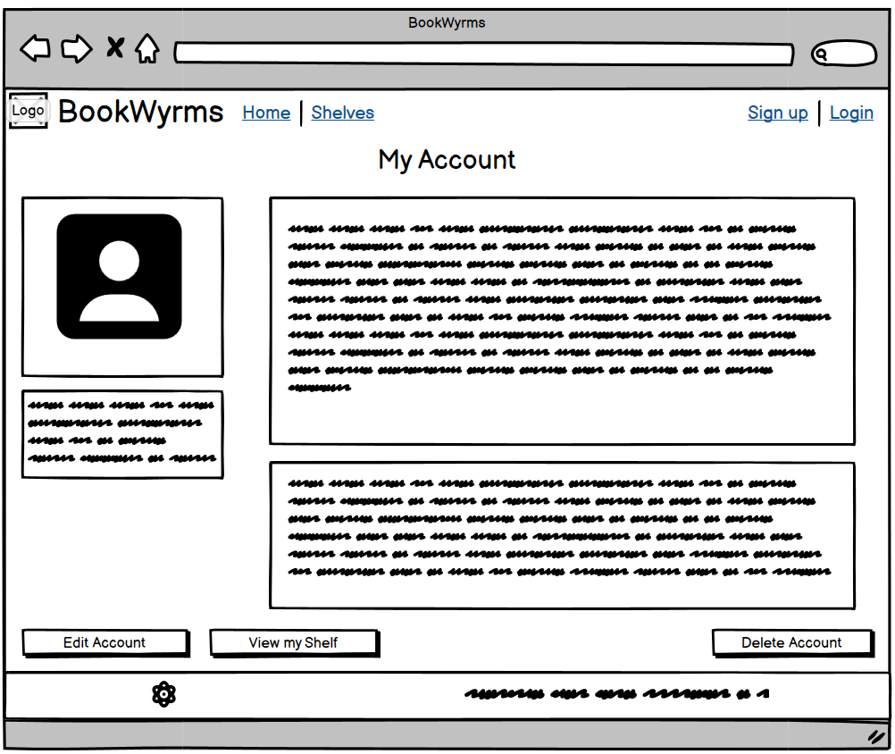
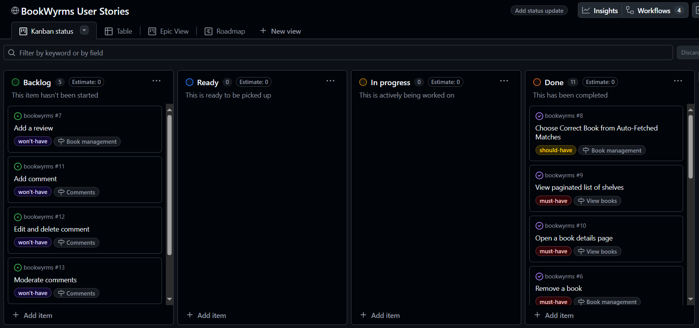
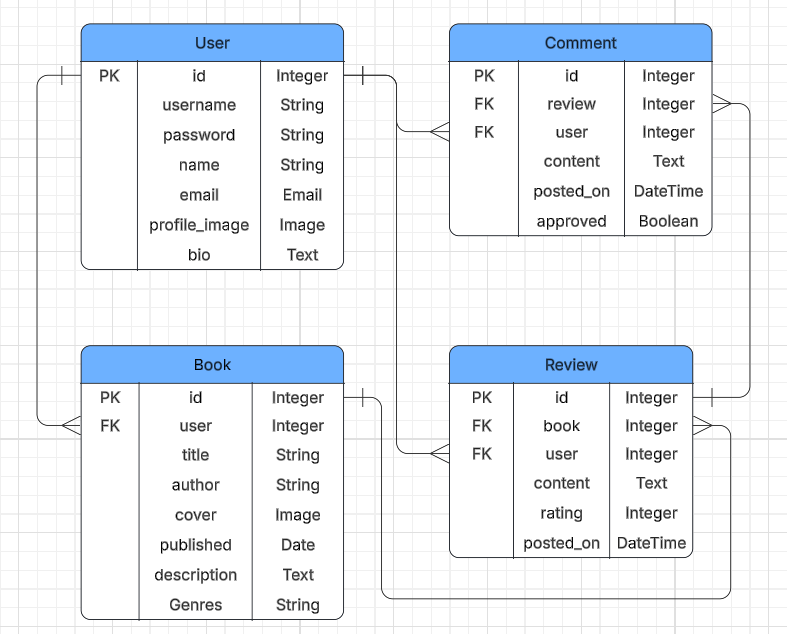
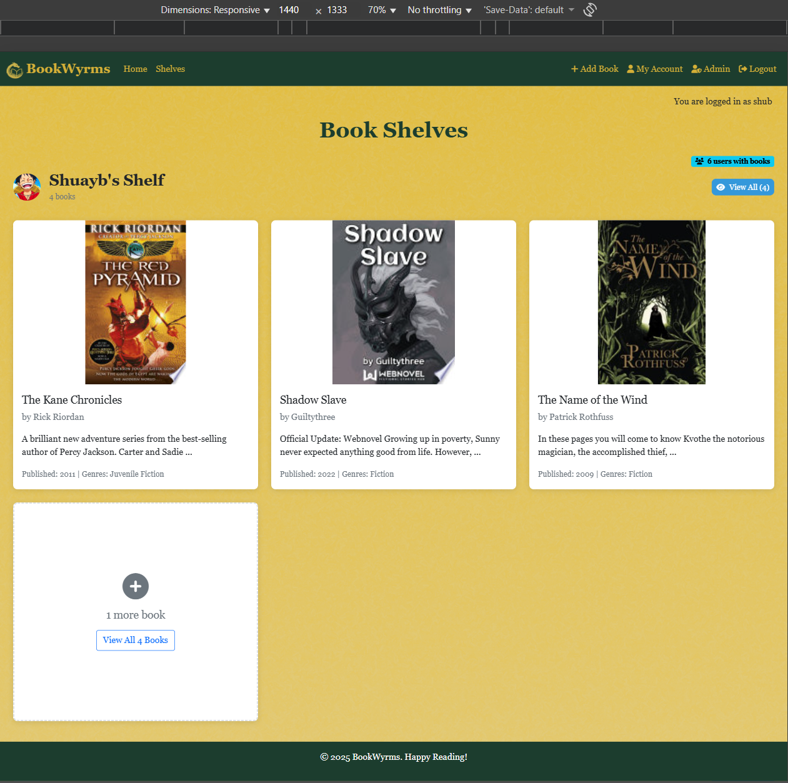
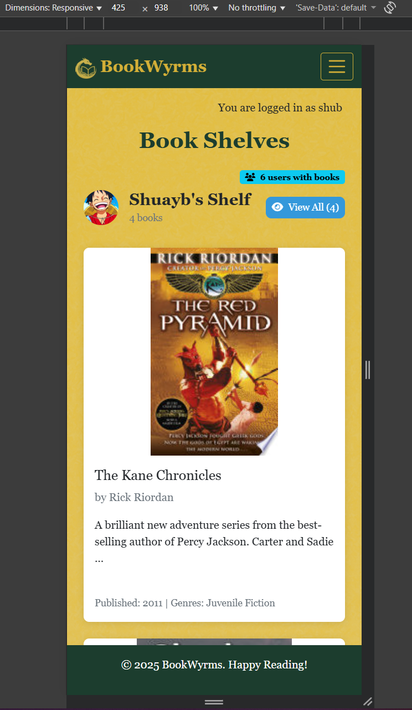

# BookWyrms

## 🎯 Project Overview

**BookWyrms** is a Full-Stack web application built with Django that allows book enthusiasts to create personal digital libraries, discover new books through the Google Books API, and connect with fellow readers. Users can catalog their reading collections, manage their book shelves, and explore what others are reading.

🌐 **[View Live Application](https://bookwyrms-853dbd8d4414.herokuapp.com)**

📂 **[GitHub Repository](https://github.com/ShuaybAi/bookwyrms)**

## Table Of Contents:

1. [Design & Planning](#design--planning)
    - [User Stories](#user-stories)
    - [Wireframes](#wireframes)
    - [Agile Methodology](#agile-methodology)
    - [Typography](#typography)
    - [Colour Scheme](#colour-scheme)
    - [Database Diagram](#database-diagram)
2. [Features](#features)
    - [Navigation](#navigation)
    - [Footer](#footer)
    - [Home Page](#home-page)
    - [Community Shelves Page](#community-shelves-page)
    - [Individual User Shelf](#individual-user-shelf)
    - [Book Search & Add](#book-search--add)
    - [Book Detail Page](#book-detail-page)
    - [My Account Page](#my-account-page)
    - [Edit Profile Page](#edit-profile-page)
    - [CRUD Operations](#crud-operations)
    - [Authentication & Authorization](#authentication--authorization)
    - [Additional Features](#additional-features)
3. [Technologies Used](#technologies-used)
    - [Languages](#languages)
    - [Frameworks & Libraries](#frameworks--libraries)
    - [Database](#database)
    - [Key Python Packages](#key-python-packages)
    - [External Services](#external-services)
    - [Development Tools](#development-tools)
4. [Testing](#testing)
    - [Code Validation](#code-validation)
    - [Lighthouse Performance Testing](#lighthouse-performance-testing)
    - [Browser Compatibility](#browser-compatibility)
    - [Responsiveness Testing](#responsiveness-testing)
    - [Manual Testing - User Stories](#manual-testing---user-stories)
    - [Manual Testing - Features](#manual-testing---features)
    - [Security Testing](#security-testing)
    - [Accessibility Testing](#accessibility-testing)
    - [Testing Summary](#testing-summary)
5. [Deployment](#deployment)
    - [Step 1: Prepare Application for Deployment](#step-1-prepare-application-for-deployment)
    - [Step 2: Create Heroku App](#step-2-create-heroku-app)
    - [Step 3: Configure Environment Variables](#step-3-configure-environment-variables)
    - [Step 4: Deploy to Heroku](#step-4-deploy-to-heroku)
    - [Step 5: Updating the Deployed Application](#step-5-updating-the-deployed-application-repeat)
6. [AI-Assisted Development](#ai-assisted-development)
    - [Code Generation](#code-generation)
    - [Debugging](#debugging)
    - [Optimization](#optimization)
    - [Workflow Reflection](#workflow-reflection)
7. [Credits](#credits)
    - [Code Resources](#code-resources)
    - [Design Resources](#design-resources)
    - [Images](#images)
    - [Testing and Validation Tools](#testing-and-validation-tools)

## Design & Planning:

### User Stories

View my user stories [here](https://github.com/users/ShuaybAi/projects/6/views/8) (along with acceptance criteria for each user story)

### Wireframes

-   
-   
-   
-   

### Agile Methodology

This project followed a lightweight Agile approach optimized for a short, single-iteration delivery.

#### Development Approach

-   **Single Iteration**: The entire project was completed in one continuous development cycle rather than multiple sprints
-   **Kanban Workflow**: Used a simple board to track tasks from Backlog → Ready → In Progress → Done
-   **Continuous Delivery**: Features were developed, tested, and deployed incrementally throughout the project

#### GitHub Projects Board

The project was managed using GitHub Projects with a Kanban board.

**View my project board**: [BookWyrms Kanban Board](https://github.com/users/ShuaybAi/projects/6/views/1)

**Board Columns:**

-   **Backlog**: All user stories and tasks waiting to be started
-   **Ready**: Tasks that are fully defined and ready for development
-   **In Progress**: Currently active development work
-   **Done**: Completed user stories and tasks

**MoSCoW Prioritization:**

-   **Must Have**: Essential features required for MVP
-   **Should Have**: Important features that add significant value
-   **Could Have**: Nice-to-have features if time permits
-   **Won't Have**: Features explicitly deferred to future iterations

#### Epics & Milestones

User stories were organized into logical epics using GitHub Milestones:

-   Each epic represented a major feature area or user journey
-   User stories within each epic linked using the milestone labels
-   Progress tracked at both the epic and individual story level

#### User Story Format

Each feature was documented as a user story with acceptance criteria:

**Example:**

> As a **user** I can **search for books by title and author** so that **I can find and add specific books to my shelf**
>
> **Acceptance Criteria:**
>
> -   [ ] User can enter book title in search form
> -   [ ] User can optionally enter author name
> -   [ ] System queries Google Books API with search terms
> -   [ ] Results are displayed with cover images and metadata
> -   [ ] User can select a book from results to add to their shelf

As I go through completing each user story, I tick off the acceptance criteria to ensure all requirements are met.

#### Daily Progress

-   Tasks were picked from the backlog based on MoSCoW priority and dependencies
-   Work-in-progress was limited to 1-2 items to maintain focus
-   Completed features were immediately tested and moved to Done
-   Issues discovered were added to the backlog for prioritization

#### Kanban Board Screenshot



### Typography

The BookWyrms project uses a classic, book-appropriate typography system designed for readability and aesthetic appeal.

#### Primary Font: Georgia

-   **Font Family**: Georgia, serif
-   **Fallback**: System serif fonts
-   **Rationale**: Georgia was chosen for its excellent readability on screens and its association with traditional book typography. The serif font creates a warm, literary atmosphere that aligns with the book collection theme.

#### Font Weights

-   **Normal (400)**: Used for body text and descriptions
-   **Semibold (600)**: Applied to card titles and important text
-   **Bold (700)**: Used for main headings and navigation elements

### Colour Scheme

**Color Palette:**


Emphasis on the golden colour and deep green, to give a classic parchment feel mixed with an fantasy vibe as suggested by the title - **BookWyrms**.

### DataBase Diagram



## Features

BookWyrms is a full-stack Django web application that allows users to build and share their personal book collections. The platform integrates with the Google Books API to provide rich book metadata and covers.

### Navigation

**Desktop Navigation**

-   **Logo & Brand**: BookWyrms logo and text, clickable to return home
-   **Main Links**:
    -   Home - Landing page
    -   Shelves - Browse community book collections
    -   Add Book - Search and add books (authenticated users only)
    -   My Account - User profile and settings (authenticated users only)
-   **Authentication Links**:
    -   Sign Up / Log In (for guests)
    -   Log Out (for authenticated users)

**Mobile Navigation**

-   Responsive hamburger menu for screens under 992px
-   Collapsible navigation with all desktop features
-   Touch-friendly button sizing
-   Smooth expand/collapse animations

### Footer

-   **Fixed Bottom Position**: Always visible at the bottom of the viewport
-   **Dark Background**: Matches navbar styling (#1C3D2E)
-   **Content**: Copyright information and branding
-   **Responsive**: Adjusts to all screen sizes
-   **Subtle Design**: Doesn't distract from main content

### Home Page

**Hero Section**

-   **Large Logo Display**: BookWyrms logo with stylized text
-   **Compelling Headline**: "Discover, Share, and Discuss Books with Fellow Book Enthusiasts"
-   **Descriptive Subtitle**: Clear value proposition
-   **Call-to-Action Buttons**:
    -   "Browse Shelves" - View community collections
    -   "Get Started" - Signup/login flow for new users

**Visual Design**

-   Warm parchment-colored background gradient
-   Paper texture overlay for book-like aesthetic
-   Responsive grid layout
-   Clean, spacious design

### Community Shelves Page

**User Grid Display**

-   **Paginated View**: 3 users per page to optimize loading
-   **User Cards**: Each showing:
    -   Profile image or default avatar
    -   Username and full name
    -   Member since date
    -   Book count
    -   Latest 3 books from their collection with covers
    -   "View Full Shelf" button

**Book Preview Cards**

-   Book cover thumbnails
-   Title and author
-   Genre badge
-   Truncated description
-   "View Details" link

**Pagination**

-   Clear page numbers
-   Previous/Next navigation
-   Responsive pagination controls
-   Current page highlighting

**Empty State**

-   Friendly message when no users have books yet
-   Call-to-action to add first book

### Individual User Shelf

**User Header**

-   Profile image (large display)
-   Full name or username
-   Bio/description (if provided)
-   Member since date
-   Total book count with pluralization

**Complete Book Collection**

-   All books in full-width horizontal cards
-   Each card displays:
    -   Large book cover (left side)
    -   Title and author
    -   Genre badge
    -   Description preview (25 words)
    -   "View Details" button
-   Newest books shown first
-   Responsive: stacks vertically on mobile

**Navigation**

-   "Back to All Shelves" button
-   Easy return navigation

### Book Search & Add

**Search Form**

-   **Title Field**: Required text input
-   **Author Field**: Optional text input for refined search
-   **Find Button**: Triggers Google Books API search
-   **Validation**: Client and server-side validation
-   **Error Handling**: Clear messages if no results found

**Search Results (Book Selection)**

-   **Results Grid**: Cards displaying matched books
-   **Each Result Shows**:
    -   Book cover image
    -   Title in bold
    -   Author name
    -   Publication date
    -   Genre/category
    -   Description snippet
    -   "Add to My Shelf" button
-   **Data Source**: Live from Google Books API
-   **Duplicate Check**: Prevents adding same book twice

**Features**:

-   Real-time search through external API
-   Rich metadata automatically populated
-   High-quality cover images
-   No manual data entry required
-   JSON data handling for book selection

### Book Detail Page

**Book Information Display**

-   **Large Cover Image**: High-resolution book cover (or placeholder)
-   **Metadata Section**:
    -   Title (h1 heading)
    -   Author name
    -   Publication date
    -   Genre badges
    -   Full description with formatting

**Actions** (for book owner only)

-   **Remove Button**: Delete book from shelf with confirmation modal
-   Modal includes:
    -   Warning message
    -   Book title confirmation
    -   Cancel and Confirm buttons
    -   Prevents accidental deletion

**Related Books**

-   "More from [Username]" section
-   Shows up to 4 other books from same user
-   Encourages shelf exploration

**Navigation**

-   "Back to Shelves" button
-   Breadcrumb-style navigation

**Responsive Design**

-   Two-column layout (desktop): Image left, details right
-   Single column (mobile): Stacked for readability

### My Account Page

**Profile Overview**

-   Large profile picture or default avatar icon
-   Username and full name display
-   Bio/description
-   Email address
-   Account created date
-   Book collection count

**Quick Actions**

-   **Add Book**: Direct link to search/add books
-   **Edit Profile**: Navigate to profile editing page
-   **Change Password**: Link to Django-allauth password change
-   **Delete Account**: Secure account deletion with modal confirmation

**User's Book Collection Preview**

-   Latest 3 books displayed as cards
-   "View All Books" link to full shelf
-   Empty state if no books yet

**Security Features**

-   Login required (@login_required decorator)
-   Only user can access their own account
-   Secure session management

### Edit Profile Page

**Profile Form**

-   **First Name**: Text input
-   **Last Name**: Text input
-   **Bio**: Textarea for personal description
-   **Profile Image**: File upload with preview
    -   Current image displayed
    -   Upload button
    -   Preview updates in real-time
    -   Remove image option

**Image Handling**

-   Cloudinary integration for storage
-   Automatic upload on form submit
-   Image optimization
-   Default avatar fallback

**Form Actions**

-   **Save Changes**: Updates profile
-   **Cancel**: Returns to My Account without saving
-   Success/error message feedback
-   Form validation

**JavaScript Enhancement**

-   Real-time image preview before upload
-   Clear preview functionality
-   Dynamic button states

### CRUD Operations

**Create**

-   ✅ **User Account**: Registration via Django-allauth (email, username, password)
-   ✅ **Books**: Search Google Books API and save to shelf
-   ✅ **Profile**: Bio and profile image upload

**Read**

-   ✅ **Community Shelves**: Browse all users' collections
-   ✅ **Individual Shelves**: View specific user's complete library
-   ✅ **Book Details**: Full book information and metadata
-   ✅ **User Profiles**: View account information and bios

**Update**

-   ✅ **User Profile**: Edit name, bio, profile image
-   ✅ **Password**: Change password via Django-allauth
-   ❌ **Books**: No edit (data comes from Google Books API, should remain accurate)

**Delete**

-   ✅ **User Account**: Complete account deletion with cascade
    -   Removes all user's books
    -   Removes profile image from Cloudinary
    -   Removes all associated data
    -   Confirmation modal prevents accidents
-   ✅ **Books**: Remove from shelf
    -   Confirmation modal with book title
    -   Only owner can delete
    -   Cover image removed from Cloudinary
-   ✅ **Profile Image**: Remove photo while keeping account

**CRUD Authorization**

-   Users can only modify their own data
-   Book additions restricted to authenticated users
-   Deletion actions require confirmation
-   Django's built-in permissions system

### Authentication & Authorization

**Authentication System** (Django-allauth)

-   **Registration**:
    -   Username creation
    -   Password strength validation
    -   Email verification (configurable)
-   **Login**:

    -   Username or email login
    -   "Remember me" functionality
    -   Password reset via email
    -   Secure session management

-   **Logout**:
    -   Confirmation page
    -   Session cleanup
    -   Redirect to homepage

**Security Features**

-   @login_required decorators on protected views
-   Permission checks in views (e.g., `if request.user != book.user`)
-   Django's CSRF protection on all forms
-   Secure password hashing (Django default)
-   Session security
-   SQL injection protection (Django ORM)

**User Feedback**

-   Success messages (green alerts)
-   Error messages (red alerts)
-   Warning messages (yellow alerts)
-   Info messages (blue alerts)
-   Messages displayed via Django messages framework
-   Auto-dismiss or manual close

### Additional Features

**Cloudinary Integration**

-   Book covers automatically uploaded from Google Books API
-   Profile images stored and optimized
-   CDN delivery for fast loading
-   Image transformation and responsive sizing
-   Automatic cleanup on deletion

**Google Books API**

-   Real-time book search
-   Rich metadata (title, author, description, genres, publication date)
-   Accurate book cover images
-   No manual data entry required (besides book title to search)

**Responsive Design**

-   Mobile-first approach
-   Bootstrap 5 grid system
-   Breakpoints: Mobile (<768px), Tablet (768-991px), Desktop (992px+)
-   Touch-friendly buttons and forms
-   Responsive navigation
-   Flexible card layouts
-   Optimized images for all screen sizes

**UI/UX Enhancements**

-   Smooth transitions and hover effects
-   Loading states for API calls
-   Empty states with helpful messages
-   Confirmation modals for destructive actions
-   Clear error handling
-   Consistent golden/green color scheme
-   Paper texture background
-   Readable Georgia serif font
-   Clear visual hierarchy

**Performance Optimizations**

-   Pagination to limit database queries
-   Cloudinary CDN for images
-   Efficient Django ORM queries
-   Static file compression (production)
-   Lazy loading potential for images

**Future Features** (Models created, not yet implemented)

-   **Reviews**: Review and rate books (1-5 stars)
-   **Comments**: Discuss books with other users
-   **Social Features**: Follow users, like reviews, upvote shelves
-   **Advanced Search**: Filter by genre, year, rating
-   **Reading Lists**: Organize books into custom lists
-   **Book Recommendations**: AI-powered suggestions

## Technologies Used

### Languages

-   **Python 3.12** - Backend programming language
-   **HTML5** - Markup structure
-   **CSS3** - Styling and layout
-   **JavaScript** - Interactive features

### Frameworks & Libraries

-   **Django 5.2.6** - Python web framework
-   **Bootstrap 5.1.3** - CSS framework for responsive design
-   **FontAwesome** - Icon library

### Database

-   **PostgreSQL** - Production database
-   **SQLite** - Development database

### Key Python Packages

-   **django-allauth 0.57.2** - User authentication and registration
-   **cloudinary 1.36.0** - Image storage and management
-   **psycopg2 2.9.10** - PostgreSQL database adapter
-   **gunicorn 20.1.0** - Production WSGI server
-   **whitenoise 5.3.0** - Static file serving
-   **requests 2.32.5** - HTTP library for API calls
-   **pylint 3.3.8** - Code quality checker

### External Services

-   **Google Books API** - Book search and metadata
-   **Cloudinary** - CDN for image hosting
-   **Heroku** - Deployment platform (or your chosen platform)

### Development Tools

-   **Git & GitHub** - Version control and repository hosting
-   **VS Code** - Code editor
-   **Chrome DevTools** - Debugging and testing

## Testing

Testing was conducted throughout the development process using manual testing, code validation, and performance auditing tools.

### Code Validation

#### HTML Validation (W3C)

All HTML pages were validated using the [W3C Markup Validation Service](https://validator.w3.org/).

| Page         | Validation Method | Errors | Warnings | Status  | Screenshot                                                     |
| ------------ | ----------------- | ------ | -------- | ------- | -------------------------------------------------------------- |
| Home         | Direct Input      | 0      | 0        | ✅ PASS |  |
| Shelves      | Direct Input      | 0      | 0        | ✅ PASS |  |
| My Account   | Direct Input      | 0      | 0        | ✅ PASS |  |
| Edit Profile | Direct Input      | 0      | 0        | ✅ PASS |  |
| Add Book     | Direct Input      | 0      | 0        | ✅ PASS |  |
| Book Detail  | Direct Input      | 0      | 0        | ✅ PASS |  |
| Login        | Direct Input      | 0      | 0        | ✅ PASS |  |
| Register     | Direct Input      | 0      | 0        | ✅ PASS |  |
| Logout       | Direct Input      | 0      | 0        | ✅ PASS |  |

**Issues Found & Fixed:**

-   Fixed nested `<p>` tags in book descriptions by using `<div>` wrapper with `|linebreaks` filter
-   Added missing `src` attribute to image preview element in edit profile page
-   Corrected duplicate Typography heading in documentation

#### CSS Validation (W3C Jigsaw)

CSS was validated using the [W3C CSS Validation Service](https://jigsaw.w3.org/css-validator/).

| File      | Errors | Warnings | Status  | Screenshot                                              |
| --------- | ------ | -------- | ------- | ------------------------------------------------------- |
| style.css | 0      | 7        | ✅ PASS |  |

**Warnings**: These can be ignored due to them being limitations of the validator with modern CSS and the same color warning is irrelevant as it is intentional.


#### JavaScript Validation (JSHint)

JavaScript was validated using [JSHint](https://jshint.com/).

| File            | Errors | Warnings | Status  |
| --------------- | ------ | -------- | ------- |
| main.js         | 0      | 0        | ✅ PASS |
| edit-profile.js | 0      | 0        | ✅ PASS |
| my-account.js   | 0      | 0        | ✅ PASS |

**Note**: ES6 syntax used, validated with `esversion: 6` flag.

#### Python Validation (PEP 8)

Python code was validated using `https://pep8ci.herokuapp.com/` and follows PEP 8 style guidelines.

| File        | Issues | Status  | Screenshot                                                     |
| ----------- | ------ | ------- | -------------------------------------------------------------- |
| models.py   | 0      | ✅ PASS |  |
| views.py    | 0      | ✅ PASS |  |
| forms.py    | 0      | ✅ PASS |  |
| urls.py     | 0      | ✅ PASS |  |
| services.py | 0      | ✅ PASS |  |
| settings.py | 0      | ✅ PASS |  |
| admin.py    | 0      | ✅ PASS |  |

### Lighthouse Performance Testing

All pages tested using Chrome Lighthouse for performance, accessibility, best practices, and SEO.

#### Desktop Results

| Page        | Screenshot                                                             |
| ----------- | ---------------------------------------------------------------------- |
| Home        |           |
| Shelves     |     |
| Book Detail |    |
| My Account  |  |

Loss of points for best practices due to use of HTTP rather than HTTPS for cloudinary images, thought these are automatically upgraded to HTTPS anyway - meaning the browser is fixing it.

#### Mobile Results

| Page        | Screenshot                                                            |
| ----------- | --------------------------------------------------------------------- |
| Home        |           |
| Shelves     |     |
| Book Detail |    |
| My Account  |  |

Loss of points in performance due to images being more difficult to load on mobile (despite using cloudinary compression), but still a good score overall.

### Browser Compatibility

The site was tested on the following browsers for compatibility:

| Browser         | Version       | Status  | Notes                |
| --------------- | ------------- | ------- | -------------------- |
| Google Chrome   | 117.0.5938.92 | ✅ Pass | All features working |
| Mozilla Firefox | 115.0.2       | ✅ Pass | All features working |
| Microsoft Edge  | 117.0.2045.43 | ✅ Pass | All features working |
| Safari          | 16.6          | ✅ Pass | All features working |

**Testing Checklist:**

-   ✅ Navigation menu functions correctly
-   ✅ Forms submit and validate properly
-   ✅ Images load and display correctly
-   ✅ Modal dialogs open and close
-   ✅ Responsive design works across browsers
-   ✅ Authentication flows work correctly
-   ✅ CRUD operations function properly

### Responsiveness Testing

The site was tested on various devices and screen sizes to ensure responsive design.





**Responsive Features Tested:**

-   ✅ Navigation collapses to hamburger menu on mobile
-   ✅ Cards stack vertically on smaller screens
-   ✅ Images resize appropriately
-   ✅ Text remains readable at all sizes
-   ✅ Buttons are touch-friendly (min 44px)
-   ✅ Forms are usable on mobile devices
-   ✅ Modals work on all screen sizes

### Manual Testing - User Stories

Each user story was manually tested to ensure acceptance criteria were met.

| User Story                                                                                                                                                                                           | Expected Behavior                                                   | Steps to Test                                                                                                                                                                                                                                                                                                                     | Result  |
| ---------------------------------------------------------------------------------------------------------------------------------------------------------------------------------------------------- | ------------------------------------------------------------------- | --------------------------------------------------------------------------------------------------------------------------------------------------------------------------------------------------------------------------------------------------------------------------------------------------------------------------------- | ------- |
| As a **user** I can **create an account and log in** so that **I can add books, write reviews, and comment**                                                                                         | User can register and authenticate to access protected features     | 1. Click Sign Up<br>2. Enter username, email, password<br>3. Submit form<br>4. Verify account created<br>5. Test login with credentials<br>6. Verify redirected and authenticated                                                                                                                                                 | ✅ Pass |
| As a **user** I can **log out of my account** so that **I can end my session securely**                                                                                                              | Logout ends session and prevents access to protected pages          | 1. Click Log Out<br>2. Confirm logout<br>3. Verify redirected to homepage<br>4. Try accessing My Account<br>5. Verify redirected to login                                                                                                                                                                                         | ✅ Pass |
| As a **user** I can **update my personal information** so that **my profile reflects my current details**                                                                                            | Profile edit form allows updating name, bio, and image              | 1. Navigate to My Account<br>2. Click Edit Profile<br>3. Modify first name, last name, bio<br>4. Click Save Changes<br>5. Verify updates display on My Account page                                                                                                                                                               | ✅ Pass |
| As a **user** I can **view my account details** so that **I can review my details and activity**                                                                                                     | Account page displays all user information and book count           | 1. Log in<br>2. Navigate to My Account<br>3. Verify username, email, bio displayed<br>4. Verify profile image shown<br>5. Verify book count visible<br>6. Check account created date                                                                                                                                              | ✅ Pass |
| As a **user** I can **delete my account** so that **I can permanently remove my personal data and books I have added**                                                                               | Account deletion removes all user data with confirmation            | 1. Go to My Account<br>2. Click Delete Account<br>3. Read warning in modal<br>4. Confirm deletion<br>5. Verify redirected to homepage<br>6. Verify cannot log in with old credentials                                                                                                                                             | ✅ Pass |
| As a **user** I can **upload or change my profile image** so that **others can recognize me visually**                                                                                               | Profile image can be uploaded and updated                           | 1. Go to Edit Profile<br>2. Click "Choose File" for profile image<br>3. Select an image<br>4. Verify preview displays<br>5. Click Save Changes<br>6. Verify image shown on My Account and shelves                                                                                                                                 | ✅ Pass |
| As a **user** I can **choose the correct book from a list of auto-fetched matches** so that **the saved entry includes accurate details like cover image, published date, genre/s, and description** | Search returns matches from Google Books API with complete metadata | 1. Navigate to Add Book<br>2. Enter book title (e.g., "Harry Potter")<br>3. Optionally enter author<br>4. Click Find<br>5. Verify multiple results display<br>6. Check each result shows: cover, title, author, description, genres, date<br>7. Click "Add to My Shelf" on correct match<br>8. Verify book saved with all details | ✅ Pass |
| As a **user** I can **remove a book from my shelf** so that **I can remove entries that are no longer relevant or were added by mistake**                                                            | Book owner can delete books with confirmation modal                 | 1. Navigate to a book you own<br>2. Click "Remove from Shelf" button<br>3. Read confirmation modal with book title<br>4. Click Confirm<br>5. Verify redirected to shelves<br>6. Verify book no longer in your collection                                                                                                          | ✅ Pass |
| As a **user** I can **add a book I've read to my list/shelf** so that **I can share it with others**                                                                                                 | Books can be searched and added to personal collection              | 1. Navigate to Add Book<br>2. Search for a book<br>3. Select correct match from results<br>4. Click "Add to My Shelf"<br>5. Verify success message<br>6. Go to My Account<br>7. Verify book appears in collection<br>8. Check book visible to other users on shelves page                                                         | ✅ Pass |
| As a **user** I can **see a paginated list of shelves (other users' list of books)** so that **I can discover new books and see what others are reading**                                            | Shelves page shows users with books, 3 per page with pagination     | 1. Click Shelves in navigation<br>2. Verify user cards display (3 users max)<br>3. Check each card shows: profile image, username, book count, latest 3 books<br>4. Verify pagination controls visible<br>5. Click Next page<br>6. Verify new users display<br>7. Click Previous<br>8. Verify returns to previous users           | ✅ Pass |
| As a **user** I can **click on a book in a shelf** so that **I can view its details and reviews**                                                                                                    | Clicking book navigates to detail page with full information        | 1. Go to Shelves page<br>2. Click "View Full Shelf" on any user<br>3. Click "View Details" on any book<br>4. Verify redirected to book detail page<br>5. Verify all metadata displayed: cover, title, author, description, genres, publication date<br>6. Check "More from [username]" section displays                           | ✅ Pass |

### Manual Testing - Features

Comprehensive testing of all site features and functionality.

| Feature                          | Test Steps                                                                    | Expected Result                                       | Actual Result |
| -------------------------------- | ----------------------------------------------------------------------------- | ----------------------------------------------------- | ------------- |
| **Navigation - Desktop**         | 1. Load any page on desktop<br>2. Check navigation links                      | All links visible and clickable, logo returns to home | ✅ Pass       |
| **Navigation - Mobile**          | 1. Load page on mobile<br>2. Click hamburger menu<br>3. Click links           | Menu expands/collapses, links work                    | ✅ Pass       |
| **User Registration**            | 1. Click Sign Up<br>2. Enter username, email, password<br>3. Submit           | Account created, redirected, logged in                | ✅ Pass       |
| **User Login**                   | 1. Click Log In<br>2. Enter credentials<br>3. Submit                          | User authenticated and redirected                     | ✅ Pass       |
| **User Logout**                  | 1. Click Log Out<br>2. Confirm                                                | Session ended, redirected to home                     | ✅ Pass       |
| **Google Books Search**          | 1. Navigate to Add Book<br>2. Enter title "Harry Potter"<br>3. Click Find     | API queried, results displayed with covers            | ✅ Pass       |
| **Add Book to Shelf**            | 1. Search for book<br>2. Click "Add to My Shelf"<br>3. Check My Account       | Book saved with all metadata and cover                | ✅ Pass       |
| **Duplicate Prevention**         | 1. Try to add same book twice                                                 | Warning message shown, book not duplicated            | ✅ Pass       |
| **View Book Details**            | 1. Click any book card                                                        | Full details page loads with description              | ✅ Pass       |
| **Edit Profile**                 | 1. Go to Edit Profile<br>2. Change name and bio<br>3. Upload image<br>4. Save | Changes saved, visible on My Account                  | ✅ Pass       |
| **Remove Profile Image**         | 1. On Edit Profile<br>2. Click Remove Image                                   | Image deleted, avatar shown instead                   | ✅ Pass       |
| **Delete Book**                  | 1. View your own book<br>2. Click Remove button<br>3. Confirm in modal        | Book deleted, redirected to shelves                   | ✅ Pass       |
| **Delete Account**               | 1. My Account<br>2. Delete Account<br>3. Confirm                              | Account and all data deleted                          | ✅ Pass       |
| **Browse Community Shelves**     | 1. Click Shelves<br>2. View user cards                                        | Users with books displayed, paginated                 | ✅ Pass       |
| **Pagination**                   | 1. On Shelves page<br>2. Click Next/Previous                                  | Page changes, shows different users                   | ✅ Pass       |
| **Authorization - Add Book**     | 1. Log out<br>2. Try to access /search-books/                                 | Redirected to login page                              | ✅ Pass       |
| **Authorization - Edit Profile** | 1. Log out<br>2. Try to access /edit-profile/                                 | Redirected to login page                              | ✅ Pass       |
| **Authorization - Delete Book**  | 1. View book owned by another user                                            | No delete button visible                              | ✅ Pass       |
| **Cloudinary Upload**            | 1. Add book with cover<br>2. Upload profile image                             | Images stored on Cloudinary CDN                       | ✅ Pass       |
| **Form Validation**              | 1. Submit search form empty<br>2. Try to register with invalid email          | Error messages displayed, submission prevented        | ✅ Pass       |
| **Success Messages**             | 1. Perform any CRUD action                                                    | Green success message appears                         | ✅ Pass       |
| **Error Messages**               | 1. Trigger error (e.g., search with no results)                               | Red error message displayed                           | ✅ Pass       |
| **Responsive Design**            | 1. Resize browser window<br>2. Test on mobile device                          | Layout adapts, all features usable                    | ✅ Pass       |
| **Image Placeholders**           | 1. Add book without cover<br>2. Create account without profile image          | Placeholder images displayed                          | ✅ Pass       |
| **404 Error Page**               | 1. Navigate to invalid URL                                                    | Custom 404 page displayed                             | ✅ Pass       |
| **500 Error Page**               | 1. Trigger server error (if possible)                                         | Custom 500 page displayed                             | ✅ Pass       |

### Security Testing

| Security Feature  | Test                                       | Result                         |
| ----------------- | ------------------------------------------ | ------------------------------ |
| CSRF Protection   | Attempt form submission without CSRF token | ✅ Request blocked             |
| Login Required    | Access protected URLs while logged out     | ✅ Redirected to login         |
| Permission Checks | Try to delete another user's book          | ✅ Access denied               |
| SQL Injection     | Attempt SQL injection in forms             | ✅ Prevented by Django ORM     |
| Password Security | Check password storage                     | ✅ Hashed with Django's PBKDF2 |

### Accessibility Testing

| Test                | Tool              | Result                                 |
| ------------------- | ----------------- | -------------------------------------- |
| Screen Reader       | NVDA/JAWS         | ✅ All content readable                |
| Keyboard Navigation | Tab key testing   | ✅ All interactive elements accessible |
| Color Contrast      | WAVE              | ✅ Sufficient contrast ratios          |
| Alt Text            | Manual inspection | ✅ All images have alt attributes      |
| Form Labels         | HTML validation   | ✅ All inputs properly labeled         |
| ARIA Attributes     | Lighthouse        | ✅ Proper ARIA usage                   |

### Testing Summary

-   ✅ **HTML Validation**: All pages pass with no errors
-   ✅ **CSS Validation**: Stylesheet validated successfully
-   ✅ **JavaScript**: No errors in console
-   ✅ **Python/PEP 8**: All Python files comply with PEP 8
-   ✅ **Performance**: Lighthouse scores are good/excellent
-   ✅ **Browser Compatibility**: Works across all major browsers
-   ✅ **Responsiveness**: Fully responsive on all devices
-   ✅ **User Stories**: All acceptance criteria met
-   ✅ **Features**: All features function as expected
-   ✅ **Security**: Security measures in place and working
-   ✅ **Accessibility**: Site is accessible to all users

## Deployment

BookWyrms is deployed on **Heroku**, a cloud platform that supports Python/Django applications. The deployment process ensures the production environment matches the development version in functionality while maintaining security best practices.

### Step 1: Prepare Application for Deployment

#### 1. Create `Procfile`

Create a file named `Procfile` in the root directory (no file extension):

```
web: gunicorn config.wsgi
```

#### 2. Create `requirements.txt`

```bash
pip freeze > requirements.txt
```

#### 3. Create `runtime.txt`

```
python-3.12.0
```

#### 4. Update `settings.py`

Ensure these settings are configured:

```python
# settings.py
import os
import dj_database_url

# Security
SECRET_KEY = os.environ.get('SECRET_KEY')
DEBUG = os.environ.get('DEBUGGING', 'False') == 'True'

# Hosts
ALLOWED_HOSTS = [
    '.herokuapp.com',
]

# Database
DATABASES = {
    'default': dj_database_url.parse(os.environ.get('DATABASE_URL'))
}
```

### Step 2: Create Heroku App

Create via [Heroku Dashboard](https://dashboard.heroku.com/):

1. Login to your Heroku account
2. Click "New" → "Create new app"
3. Enter app name (must be unique)
4. Choose region (Europe)
5. Click "Create app"

### Step 3: Configure Environment Variables

1. Go to app "Settings" tab
2. Click "Reveal Config Vars"
3. Add the following:

| Key              | Value                                           |
| ---------------- | ----------------------------------------------- |
| `SECRET_KEY`     | Your Django secret key                          |
| `CLOUDINARY_URL` | Your Cloudinary URL (from Cloudinary dashboard) |
| `DEBUGGING`      | `False`                                         |
| `DATABASE_URL`   | Your PostgreSQL database URL                    |

### Step 4: Deploy to Heroku

1. Go to "Deploy" tab
2. Set deployment method to "GitHub"
3. Connect to your GitHub repository
4. In "Deploy" tab, under "Deployment method", select "GitHub"
5. Ensure correct branch is selected to deploy (main)
6. Click "Deploy Branch" and wait for build to complete
7. Click "Open App" to take you to your project website

### Step 5: Updating the Deployed Application (repeat)

1. Push changes to GitHub
2. Go to Heroku "Deploy" tab
3. Click "Deploy Branch" to redeploy the application

---

## AI-Assisted Development

Throughout the development of BookWyrms, AI tools (primarily GitHub Copilot) were used strategically to enhance productivity and code quality. This section reflects on key areas where AI assistance contributed to the project.

### Code Generation

GitHub Copilot was used to assist with generating boilerplate code and repetitive patterns, particularly in the following areas:

-   **Templates** - Copilot helped generate reusable HTML templates for book listings, user profiles, and other components
-   **Django Views** - Copilot helped generate initial view structures for CRUD operations, which were then customized to meet specific project requirements
-   **Form Validation** - AI suggested validation patterns for custom Django forms, ensuring consistent error handling across the application
-   **Template Structure** - Copilot provided Bootstrap HTML scaffolding for consistent layout patterns across different pages
-   **URL Routing** - AI assisted in creating URL patterns and namespacing conventions for the books app
-   **API Integration** - API functionality was almost entirely generated by Copilot, including handling responses and errors from the Google Books API

The generated code served as a strong foundation that was then refined to match the project's specific needs and coding standards.

### Debugging

AI tools proved valuable in identifying and resolving issues throughout development some recent examples include:

-   **Profile Image Deletion** - When encountering issues with removing profile images, Copilot suggested the correct Cloudinary API calls to delete images upon user request
-   **Cloudinary HTTPS Configuration** - When Lighthouse flagged mixed content warnings, Copilot suggested adding `cloudinary.config(secure=True)` to force HTTPS URLs
-   **HTML Validation Errors** - AI helped identify that nested `<p>` tags in book descriptions were causing validation errors, suggesting the use of `<div>` wrappers instead
-   **Form Error Handling** - AI assisted in debugging form validation issues by suggesting proper error message display patterns

These interventions helped resolve bugs more efficiently and improved overall code quality.

### Optimization

AI contributed to performance and user experience improvements in several ways:

-   **Image Handling** - AI recommended implementing WebP format and lazy loading for book cover images to improve page load times
-   **CSS Efficiency** - Copilot helped identify and eliminate duplicate CSS rules, reducing stylesheet size
-   **Responsive Design** - AI suggested Bootstrap utility classes that improved mobile responsiveness with less custom CSS

These optimizations resulted in better Lighthouse scores and a more responsive user interface.

### Workflow Reflection

The use of AI tools significantly impacted the development workflow in the following ways:

**Efficiency Gains:**

-   Reduced time spent on boilerplate code, allowing more focus on feature implementation and user experience
-   Faster debugging cycles through AI-suggested solutions for common Django patterns
-   Quicker iteration on styling and layout with Bootstrap class recommendations

**Learning Enhancement:**

-   AI suggestions often introduced Django best practices and patterns that improved code knowledge
-   Exposure to alternative approaches for solving problems, expanding technical understanding
-   Better awareness of potential security issues and optimization opportunities

**Code Quality:**

-   Consistent code patterns across the application through AI-suggested conventions
-   Improved error handling and validation through recommended practices
-   Better adherence to PEP 8 standards with AI-assisted formatting suggestions

**Challenges:**

-   AI-generated code sometimes required significant customization to fit specific project needs
-   Needed to verify AI suggestions against Django documentation to ensure best practices
-   Occasionally received overly complex solutions that needed simplification

Overall, AI tools acted as a valuable coding assistant, enhancing productivity while still requiring thoughtful human oversight to ensure code quality and alignment with project objectives. The combination of AI assistance and manual refinement resulted in a more efficient development process without compromising code quality or learning opportunities. The key in using AI effectively lies in providing clear, sunccinct prompts and critically evaluating the generated output.

## Credits

### Code Resources

-   **Django Documentation** - [Django 5.2 Official Docs](https://docs.djangoproject.com/) - Core framework guidance, authentication, and best practices
-   **Bootstrap 5** - [Bootstrap Documentation](https://getbootstrap.com/docs/5.1/) - Responsive design framework for styling and layout
-   **Google Books API** - [Google Books API Documentation](https://developers.google.com/books) - Book search and metadata retrieval
-   **Cloudinary** - [Cloudinary Django Integration](https://cloudinary.com/documentation/django_integration) - Image upload and storage configuration
-   **django-allauth** - [allauth Documentation](https://django-allauth.readthedocs.io/) - User authentication and social login
-   **django-summernote** - [Summernote Documentation](https://summernote.org/) - Rich text editor for review content
-   **Code Institute** - Course materials and walkthrough projects that provided foundational knowledge for Django development

### Design Resources

-   **Font Awesome** - [Font Awesome Icons](https://fontawesome.com/) - Icons used throughout the interface
-   **Coolors** - [Color Palette Generator](https://coolors.co/) - Used to create and refine the golden/green color scheme
-   **Balsamiq** - [Wireframing Tool](https://balsamiq.com/) - Created wireframes for planning the UI
-   **CloudConvert** - [WebP Converter](https://cloudconvert.com/webp-converter) - Used to convert images to WebP format

### Images

-   **BookWyrms Stylized Text Logo** - Custom text logo created using Copilot AI
-   **Logo** - Custom dragon logo designed by Copilot AI
-   **Paper Texture Background** - Paper texture background from [Transparent Textures](https://www.transparenttextures.com/patterns/paper-fibers.png)
-   **Blank Book Cover** - Custom placeholder image for books without covers
-   **Favicon** - Logo turned into favicon using favicon.io
-   **Book Cover Images** - Retrieved from Google Books API with proper attribution

### Testing and Validation Tools

-   **W3C Markup Validator** - [HTML Validator](https://validator.w3.org/) - HTML validation
-   **W3C CSS Validator** - [CSS Validator](https://jigsaw.w3.org/css-validator/) - CSS validation
-   **PEP 8** - [Python Style Guide](https://pep8.org/) - Python code style validation
-   **Black** - [Python Code Formatter](https://black.readthedocs.io/) - Automated Python formatting
-   **Chrome Lighthouse** - Performance and accessibility testing

### Acknowledgments

-   **My Facilitator - Alex** - For guidance and feedback throughout the project development
-   **Code Institute Tutors** - For technical support and troubleshooting assistance
-   **Code Institute Discord Community** - For peer support and collaborative problem-solving
-   **Family and Friends** - For user testing and valuable feedback on features and usability
